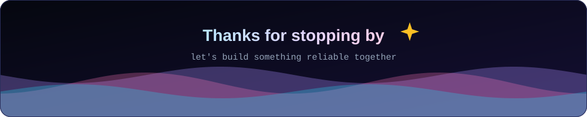

<p align="center">
  
</p>

<p align="center">
  <a href="mailto:shrey04kaitke@gmail.com"></a>
  <a href="https://www.linkedin.com/in/shreyashi-kaitke-1691b4332"></a>
  <a href="https://github.com/shrey04kaitke-sys"></a>
  
</p>


## 👋 About Me

Hi, I'm **Shreyashi** (you can call me **Shrey**). I'm an **AI & Data Science** student at **VIT Pune** (graduating 2028) who likes building things that are **smart, explainable and actually safe to use**. I don't just want a model with a good score. I want people to understand *why* it made a decision.

- 🔭 **Working on:** the **Creditworthiness Registry** (zero-knowledge proofs on the blockchain) and **ProofLens**, my biggest idea yet
- 🌱 **Learning:** AWS, cloud and backend systems
- 🧪 **Built so far:** a zero-knowledge credit registry, a fraud-detection API, a multi-database benchmark and an AI + IoT water-quality monitor


## 🧠 How I Think

```python
class Shrey:
    name       = "Shreyashi Kaitke"
    studying   = "AI & DS @ VIT Pune"
    building   = "ProofLens: AI you can verify, not just trust"
    skills     = ["data science", "ML", "vision", "agentic AI", "blockchain"]
    builds     = ["explainable AI", "safe automation", "fintech + security"]
    works_like = [
        "ship something that runs, not just a demo",
        "show the 'why' behind every prediction",
        "learn in public, one commit at a time",
    ]
    learning   = ["AWS", "backend systems", "DSA"]
    motto      = "Intelligence recommends. Safety decides."
```

<!-- Add your own hobbies / fun facts here, for example: favourite music, what you do to relax, a book you love -->

**📚 Learning in public:** my practice repos are open for anyone to see how I grow: [Python-Learning](https://github.com/shrey04kaitke-sys/Python-Learning) · [CPP-Learning](https://github.com/shrey04kaitke-sys/CPP-Learning) · [DSA-Journey](https://github.com/shrey04kaitke-sys/DSA-Journey)


## 🛠️ Tech Stack

| Area | Tools |
|---|---|
| **🐍 Languages** |     |
| **🧠 AI / Machine Learning** |           |
| **📚 Frameworks & Libraries** |           |
| **🤖 GenAI & AI Tools** |    |
| **🌐 Web & Backend** |      |
| **⛓️ Blockchain & Web3** |       |
| **☁️ Cloud & DevOps** |       |
| **🗄️ Databases** |     |
| **🧪 Development & Testing** |     |
| **🔌 Hardware & IoT** |   |
| **🎓 Core Computer Science** |       |


## 📊 GitHub Stats

<p align="center">
  
  
</p>
<p align="center">
  
</p>


## 📈 Contribution Activity

<p align="center">
  
</p>

<p align="center">
  
</p>

## 🤝 Let's Connect

I'm always up for team projects, research ideas and anything where AI has to be trustworthy. Say hi on [LinkedIn](https://www.linkedin.com/in/shreyashi-kaitke-1691b4332) or [email me](mailto:shrey04kaitke@gmail.com).

<p align="center">
  <i>"Intelligence recommends. Safety decides."</i>
</p>

<p align="center">
  
</p>
